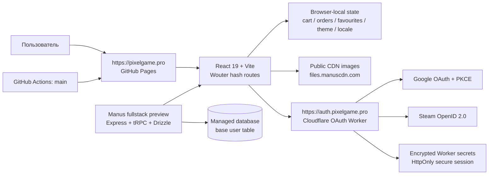

# Карта проекта PixelGame

**Версия карты:** 18 августа 2026 года.  
**Репозиторий:** [softalex96-creator/PixelGame](https://github.com/softalex96-creator/PixelGame)  
**Production-витрина:** [pixelgame.pro](https://pixelgame.pro/)  
**Назначение:** эта карта описывает исходный код, границы данных, публикацию, безопасность и порядок восстановления PixelGame. Она рассчитана на сопровождение проекта без зависимости от локального `node_modules` или сгенерированной папки `dist`.

## 1. Архитектура в одном взгляде

PixelGame — это витрина вымышленных игровых цифровых товаров в стиле аркад 1980-х годов. Каталог, корзина, избранное, язык, отображаемая валюта и симулированные заказы работают в браузере. Реальная оплата и выдача товаров отсутствуют. Публичная витрина собирается как статический React-сайт и публикуется через GitHub Pages; OAuth вынесен в отдельный Cloudflare Worker, чтобы секреты не попадали в статический клиент. [1] [2] [3]



| Контур | Роль | Что является источником истины | Что не должно попадать в клиент |
|---|---|---|---|
| **Витрина** | Каталог, поиск, фильтры, карточки, корзина, checkout-симуляция, кабинет | Исходники в `client/src/` и статический каталог в `pixelshelf-data.ts` | Секреты, платёжные данные, токены провайдеров |
| **Browser-local state** | Состояние пользовательского preview | `localStorage` и `sessionStorage` конкретного браузера | Учётные данные и реальные персональные данные |
| **OAuth Worker** | Google/Steam login, state/nonce/PKCE, защищённая сессия | `cloudflare/oauth-worker/` + encrypted Worker secrets | Секреты Google, session HMAC key, provider tokens |
| **Preview server** | Локальная разработка, tRPC, базовый Manus auth и БД-контуры | `server/`, `drizzle/`, managed environment | Не является runtime-контуром GitHub Pages |
| **GitHub Actions** | Сборка и публикация статической витрины при push в `main` | `.github/workflows/deploy-pages.yml` | Любые `.env`, токены и приватные ключи |

## 2. Репозиторий и ключевые каталоги

```text
PixelGame/
├── client/                         # React-приложение и статический UI
│   ├── index.html                  # HTML entry и шрифты
│   ├── public/                     # Только небольшие статические конфигурационные файлы
│   └── src/
│       ├── App.tsx                 # Provider tree и маршруты
│       ├── main.tsx                # Bootstrap React Query/tRPC
│       ├── pages/                  # Home, ProductDetail, Checkout, Account, NotFound
│       ├── components/             # Навигация, корзина, поиск, section links, UI primitives
│       ├── contexts/               # Auth, cart, orders, favourites, locale, theme, currency
│       ├── lib/                    # Каталог, фильтрация, buyer state, auth client, tRPC client
│       └── index.css               # Полная retro arcade visual system
├── cloudflare/oauth-worker/        # Отдельный OAuth backend на auth.pixelgame.pro
├── server/                         # Express/tRPC/Drizzle preview-server и unit tests
│   └── _core/                      # Framework plumbing: OAuth, headers, Vite, storage, context
├── drizzle/                        # Схема и миграции базы данных
├── scripts/                        # Playwright smoke checks для витрины и buyer flow
├── .github/workflows/              # GitHub Pages CI/CD
├── docs/                           # Поддерживаемая документация, включая эту карту
├── references/                     # Интеграционные и проектные справки
├── package.json                    # Скрипты, зависимости и package manager contract
├── vite.config.ts                  # Vite build, output, aliases и GitHub Pages base path
├── SECURITY.md                     # Security baseline и production verification
├── DOMAIN_MIGRATION.md             # История/инструкции доменной топологии
└── todo.md                         # Исторический журнал завершённых задач
```

| Область | Ключевые файлы | Ответственность |
|---|---|---|
| Навигация и страницы | `client/src/App.tsx`, `pages/Home.tsx`, `pages/ProductDetail.tsx`, `pages/Checkout.tsx`, `pages/Account.tsx` | Маршруты `/`, `/product/:slug`, `/checkout`, `/account`; в GitHub Pages применяется hash-router `#/…`. |
| Каталог | `client/src/lib/pixelshelf-data.ts`, `pages/Home.tsx` | 16 оригинальных локальных preview-товаров в категориях Currency, Skins, Mods и Guides; фильтры мира, категории, редкости, цены и сортировки. |
| Покупательский preview | `contexts/LocalCartContext.tsx`, `contexts/OrdersContext.tsx`, `components/CartDrawer.tsx`, `lib/buyer-state.ts` | Количество, subtotal, симулированный checkout, history, repeat order и диалог `SIMULATED ONLY`. |
| Персональные настройки | `contexts/FavouritesContext.tsx`, `LanguageContext.tsx`, `ThemeContext.tsx`, `CurrencyContext.tsx` | Избранное, EN/RU, тема и USD/EUR/RUB. |
| Header и переходы к секциям | `components/StorefrontNav.tsx`, `HomeSectionLink.tsx`, `SearchAutocomplete.tsx` | Поиск, переключатели, доступ к кабинету и корзине; section links не создают двойной hash на GitHub Pages. |
| Визуальная система | `client/src/index.css`, `client/index.html` | CRT scanlines, cabinet animation, rarity badges, responsive rules и reduced-motion fallback. |
| OAuth и защита | `cloudflare/oauth-worker/src/index.ts`, `security.ts`, `wrangler.jsonc`, `SECURITY.md` | Авторизация Google и Steam, PKCE/state/nonce, rate limit, cookies и CORS. |
| Проверки | `server/*.test.ts`, `scripts/verify-retro-arcade-assets.mjs`, `scripts/verify-production-flow.mjs` | Vitest unit/regression tests и Playwright desktop/mobile smoke flows. |

## 3. Маршруты и пользовательские потоки

| URL/маршрут | Экран | Основные операции | Особенности production |
|---|---|---|---|
| `#/` | `Home.tsx` | Поиск, 4 аркадные линии, фильтры по миру/типу/редкости/цене, карточки | На `pixelgame.pro` корневой маршрут остаётся в URL при прокрутке к каталогу. |
| `#/product/:slug` | `ProductDetail.tsx` | Просмотр товара, избранное, добавление в local cart | Контент только preview; товар берётся из локального статического каталога. |
| `#/checkout` | `Checkout.tsx` | Email/player tag preview, simulated payment, loading и confetti | Реальное списание, реальная доставка и передача платёжных данных отсутствуют. |
| `#/account` | `Account.tsx` | Local orders, saved items, repeat order, Google/Steam session status | Apple ID и Telegram намеренно отображаются как недоступные. |
| `auth.pixelgame.pro/v1/*` | Cloudflare Worker | Login start/callback, session read, logout | Защищённый серверный контур, не GitHub Pages. |

> **Важное ограничение:** local cart, избранное и симулированные заказы привязаны к браузеру, а не к серверной коммерческой БД. Очистка browser storage или смена браузера удалит этот preview-state.

## 4. Browser-local state

| Ключ | Содержимое | Используется в |
|---|---|---|
| `pixelshelf:cart` | Идентификаторы товаров и их количество | `LocalCartContext` |
| `pixelgame:orders` | Simulated order history | `OrdersContext` |
| `pixelshelf:favourites` | Сохранённые product IDs | `FavouritesContext` |
| `pixelshelf:locale` | Выбор `en` или `ru` | `LanguageContext` |
| `pixelshelf:theme` | Светлая/тёмная тема | `ThemeContext` |
| `pixelgame:display-currency` | USD/EUR/RUB для отображения цен | `CurrencyContext` |
| `pixelgame:pending-home-section` | Кратковременное состояние поиска/избранного перед возвратом на Home | `HomeSectionLink` |

## 5. Сборка, тесты и публикация

| Команда | Результат | Когда запускать |
|---|---|---|
| `pnpm dev` | Express/Vite development server | Локальная разработка |
| `pnpm check` | TypeScript без эмиссии | До каждого commit/release |
| `pnpm test` | Vitest unit/regression suite | После изменения логики или данных |
| `pnpm verify:arcade-assets` | Проверка hero, 4 линий, rarity UI и CDN artwork на desktop/mobile | После изменения каталога/визуальных assets |
| `PIXELGAME_STOREFRONT_URL=https://pixelgame.pro/ pnpm verify:production` | Изолированный smoke flow production: routing, quantity, modal, checkout, account | После GitHub Pages deploy |
| `pnpm build:pages` | Статический GitHub Pages artifact в `dist/public` | CI и локальная проверка Pages build |
| `pnpm check:oauth-worker` | Dry-run Cloudflare Worker config | До обновления OAuth Worker |

GitHub Actions запускается на каждом push в `main`, использует Node 22, фиксированный lockfile и публикует `dist/public` в GitHub Pages. Для `pixelgame.pro` workflow устанавливает `GITHUB_PAGES_CUSTOM_DOMAIN=true`, поэтому Vite создаёт asset paths от корня `/assets/…`, а не от repository subpath. [2] [4]

## 6. Безопасность и секреты

Секреты находятся только в защищённой среде Cloudflare Worker или server environment. Нельзя архивировать или коммитить `.env`, `.dev.vars`, Worker secrets, API tokens, OAuth client secrets, Apple private keys, Steam credentials или session-signing keys. Публичная GitHub Pages сборка не должна включать эти значения. [3] [5]

| Объект | Место хранения | Правило |
|---|---|---|
| `GOOGLE_OAUTH_CLIENT_SECRET` | Cloudflare encrypted Worker secret | Никогда не добавлять в Vite env или Git. |
| `SESSION_HMAC_KEY` | Cloudflare encrypted Worker secret | Используется только Worker для подписи state/session. |
| OAuth tokens и сессии | Secure/HttpOnly/SameSite cookies на `auth.pixelgame.pro` | Не помещать в `localStorage`. |
| Public CDN artwork | `files.manuscdn.com` URL в коде | Разрешён как публичный asset, но не содержит секретов. |
| GitHub Pages artifact | `dist/public` в CI | Rebuildable output; не является source of truth. |

## 7. Резервное копирование и восстановление

Полная переносимая копия должна содержать исходники, lockfile, документацию, GitHub workflow, Cloudflare Worker source, Drizzle schema/migrations, scripts и историю задач. Для компактности и безопасности из архива исключаются:

| Исключение | Причина | Восстановление |
|---|---|---|
| `node_modules/`, `.pnpm-store/` |  Сотни мегабайт воспроизводимых зависимостей | `pnpm install --frozen-lockfile` |
| `dist/`, `build/` | Сгенерированный artifact | `pnpm build` или `pnpm build:pages` |
| `.manus-logs/`, cache, temp | Эфемерные диагностические данные | Появятся при следующем запуске |
| `.git/` | История уже сохраняется в GitHub; делает архив существенно больше | `git clone` из репозитория |
| `.env`, `.dev.vars`, токены, ключи | Конфиденциальные данные не должны передаваться архивом | Внести заново из защищённого secret manager |

### Быстрое восстановление

```bash
unzip PixelGame-project-backup-YYYY-MM-DD.zip
cd PixelGame
pnpm install --frozen-lockfile
pnpm check
pnpm test
pnpm dev
```

Для GitHub Pages дополнительно запустите `pnpm build:pages`; для проверки Worker — `pnpm check:oauth-worker`. Не восстанавливайте и не генерируйте production secrets в репозитории: они должны быть добавлены в Cloudflare dashboard как encrypted secrets.

## 8. Чек-лист изменений

| Если меняется… | Минимальный набор действий |
|---|---|
| Каталог, rarity или фильтры | Обновить `pixelshelf-data.ts`, unit tests и `verify:arcade-assets`. |
| Cart/checkout/account | Обновить contexts/pages/`buyer-state`, выполнить `pnpm test` и `verify:production`. |
| Навигация GitHub Pages | Проверить hash routing и section-navigation на production, не использовать `/#catalog` внутри Wouter hash-router. |
| OAuth provider | Сначала server-side flow, exact callback, Worker secret, CSP/CORS review и rate limit; затем UI. |
| Домены/hosting | Проверить GitHub Pages custom-domain base, DNS-only storefront records, HTTPS и изолированный `auth.pixelgame.pro`. |
| Любой release | `pnpm check`, `pnpm test`, оба browser smoke tests, commit в `main`, дождаться GitHub Actions и выполнить live verification. |

## Ссылки на исходники

[1]: https://github.com/softalex96-creator/PixelGame/blob/main/client/src/App.tsx "Routes and provider tree"
[2]: https://github.com/softalex96-creator/PixelGame/blob/main/.github/workflows/deploy-pages.yml "GitHub Pages deployment workflow"
[3]: https://github.com/softalex96-creator/PixelGame/blob/main/SECURITY.md "Production security baseline"
[4]: https://github.com/softalex96-creator/PixelGame/blob/main/vite.config.ts "Vite configuration"
[5]: https://github.com/softalex96-creator/PixelGame/tree/main/cloudflare/oauth-worker "Cloudflare OAuth Worker"
